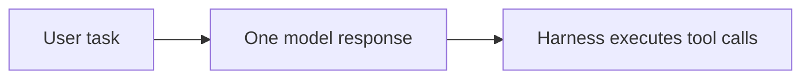
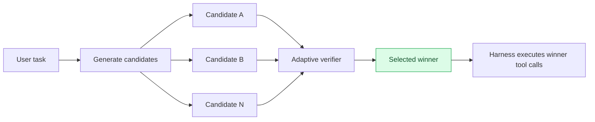
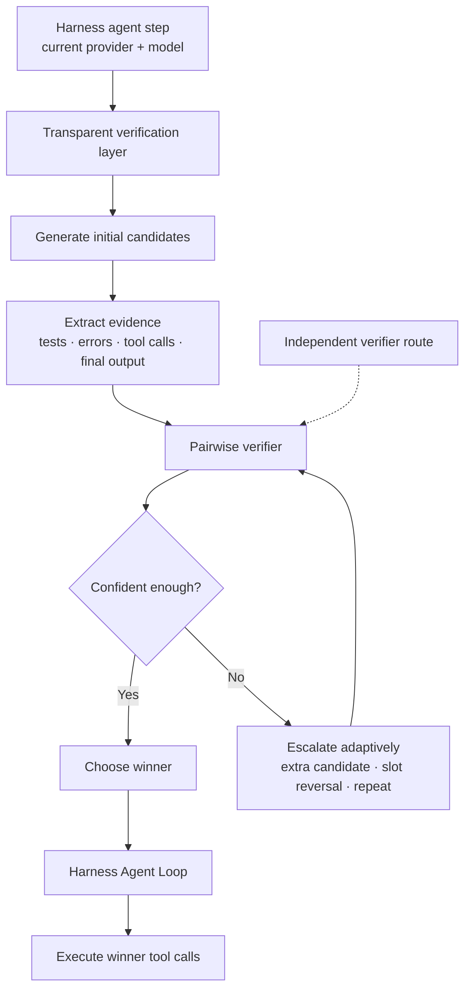

<div align="center">

# 🛡️ dsh-adaptive-verifier

**Generate more than one next step. Verify before executing. Keep only the best.**

A provider-agnostic verification layer for [DeepSeek Harness](https://github.com/deepseek-ai/deepseek-harness).
It adds test-time selection between **model generation** and **tool execution**, so an agent can compare several possible next steps before committing to one.

[简体中文](README.zh.md) · [Quick Start](#-quick-start) · [How It Works](#-how-it-works) · [Configuration](#-configuration) · [Docs](#-docs)

[](https://github.com/keepkeen/dsh-adaptive-verifier/actions/workflows/ci.yml)


</div>

> **In one sentence:** `dsh-adaptive-verifier` samples multiple candidate responses for an agent step, verifies them **before any candidate tool call is executed**, and lets only the selected winner continue through the Harness Agent Loop.

## ✨ Why this exists

Coding agents are often good at producing a plausible next step. The harder question is:

> **Should we execute this step, or was another candidate better?**

A normal agent loop takes one model response and immediately continues with it:



With `dsh-adaptive-verifier`, the agent gets a small decision layer before execution:



**Rejected candidate tool calls never reach Harness tool execution.**

That is the core of the plugin: it turns a single-shot agent step into **generate → compare → execute**.

## 🎯 What the plugin actually does

| | Behavior |
|---|---|
| **Generate** | Reuses the provider/model already selected by the current Harness agent to sample multiple candidate responses. |
| **Verify** | Compares candidates with evidence-aware pairwise judging and A–T scores. |
| **Adapt** | Spends extra calls only when the result is uncertain: add a candidate, reverse A/B slots, or repeat verification. |
| **Execute** | Replays only the winning response back to the Agent Loop; rejected tool calls do not execute. |
| **Stay provider-agnostic** | The default verifier goes through `ctx.llm`; provider adapters keep ownership of credentials and transport. |

This is **test-time verification**, not a new base model and not a replacement for Harness.

## 🧠 How it works



The generator and verifier are deliberately **separate routes**:

- **Generator route** — always follows the provider/model selected by the Harness agent.
- **Verifier route** — can follow the same Harness route, or be pinned to a different provider/model.
- **Credentials** — remain inside the selected Harness adapter in normal mode. This plugin does not copy or infer provider API keys.

So a generator can be OpenRouter, Anthropic, an OpenAI-compatible gateway, local vLLM, DeepSeek Official, or another Harness adapter.

## 🚀 Quick Start

### 1. Install the plugin

```bash
git clone https://github.com/keepkeen/dsh-adaptive-verifier.git
cd dsh-adaptive-verifier

npm install --legacy-peer-deps

dsh plugin --profile verifier-lab add .
```

### 2. Verify that Harness loaded it

```bash
dsh --profile verifier-lab --dump-config
```

You should see the `adaptive-verifier` bundle row.

### 3. Start Harness normally

```bash
dsh --profile verifier-lab
```

That's it for the default setup.

**You do not need to switch to a `deepseek-verified` provider.** Keep using the provider/model you already select in Harness.

**You do not need to give this plugin a provider API key in default `backend: harness` mode.** Harness adapters continue to own their credentials.

## ⚙️ Configuration

The default setup is intentionally small:

```yaml
- id: adaptive-verifier
  config:
    adapter:
      enabled: true
      transparent: true
      targetProviders: []     # empty = all agent-loop providers
      initialCandidates: 2
      maxCandidates: 4

    verifier:
      backend: harness        # provider-agnostic default
```

See [`examples/profile.cordis.patch.yml`](examples/profile.cordis.patch.yml) for a complete example.

### Use the same route for generation and verification

This is the default:

```yaml
verifier:
  backend: harness
```

If `provider` and `model` are omitted, the verifier follows the current agent route **through Harness**.

### Use a separate verifier model

You can keep a powerful/expensive generator while pinning verification to another route:

```yaml
verifier:
  backend: harness
  provider: deepseek-official
  model: deepseek-v4-flash
```

The verifier request still goes through Harness, so that provider's adapter handles its own credentials.

### Optional DeepSeek logprob backend

Harness' generic `StreamChunk` does not expose token logprobs, so continuous logprob scoring cannot be universal.

If you explicitly want the DeepSeek-specific A–T expected-score backend:

```yaml
verifier:
  backend: deepseek-logprob
  model: deepseek-v4-flash
```

Then configure its **dedicated verifier credential**:

```bash
export DSH_VERIFIER_DEEPSEEK_API_KEY='...'
```

This mode is opt-in and is never inferred from the generator provider/model.

| Verifier backend | Providers | Credential ownership | Score signal |
|---|---|---|---|
| `harness` | Any Harness LLM route | Harness adapter | Categorical A–T + adaptive repeats |
| `deepseek-logprob` | Explicit DeepSeek HTTP backend | Dedicated verifier config | Continuous expected A–T score from top-logprobs |

**If you are unsure, use `backend: harness`.**

## 🔍 What gets verified?

The verifier does not only read the model's final sentence. It can use evidence extracted from the candidate response/trajectory, including:

- task and specification adherence;
- observed test/build output;
- unresolved exceptions or failed commands;
- edits made after the last successful verification;
- proposed tool calls and their reversibility;
- final output and claimed success.

The guiding rule is simple: **observed evidence should beat self-reported confidence.**

## 🧩 Two ways to use it

### 1. Transparent action-level verification

This is the normal plugin mode described above. It verifies several possible **next responses** before Harness executes their tool calls.

### 2. Completed-trajectory ranking

The bundle also exposes `ctx.adaptiveVerifier` for candidates you have already produced elsewhere:

```ts
const result = await ctx.adaptiveVerifier.select(task, [
  { id: 'run-a', content: trajectoryA },
  { id: 'run-b', content: trajectoryB },
  { id: 'run-c', content: trajectoryC },
])

console.log(result.selectedId)
console.log(result.ranking)
console.log(result.budget)
```

For full Best-of-N coding trajectories, **workspace/process isolation is still the caller's responsibility**. A Harness Session fork is not a filesystem fork.

## ⚖️ Trade-offs

Verification is not free.

- It uses more model calls and tokens than single-shot generation.
- Buffering candidates increases time to first visible token.
- A verifier can share blind spots with the generator.
- The generic Harness backend does not provide token-logprob uncertainty.

The plugin therefore uses adaptive escalation: start small, spend more only when the comparison is uncertain, and stop at explicit budgets.

## 🧪 Project status

`0.2.0` implements the provider-agnostic Harness integration, adaptive ranking, evidence extraction, caching, budget control, CLI tools, tests, and the optional DeepSeek logprob backend.

This repository **does not currently claim a new Terminal-Bench or SWE-bench score**. Benchmark claims should come from a fixed candidate pool with full token/call/latency accounting.

## 📚 Docs

- [API & configuration](docs/api.md)
- [Architecture](docs/architecture.md)
- [Benchmarking](docs/benchmarking.md)
- [Isolation semantics](docs/isolation.md)
- [Security](SECURITY.md)
- [Changelog](CHANGELOG.md)

## License

MIT
