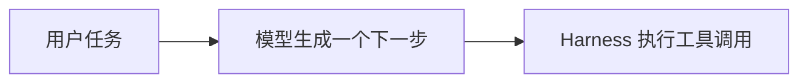
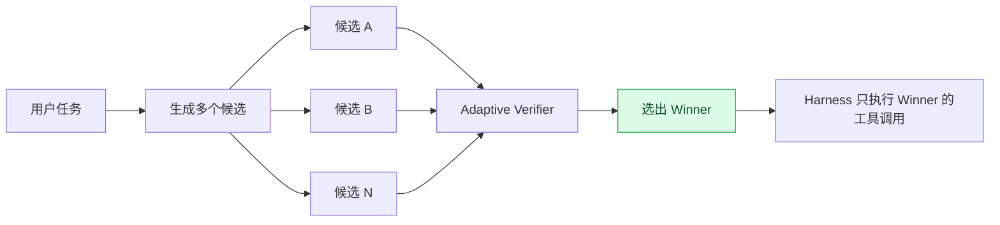
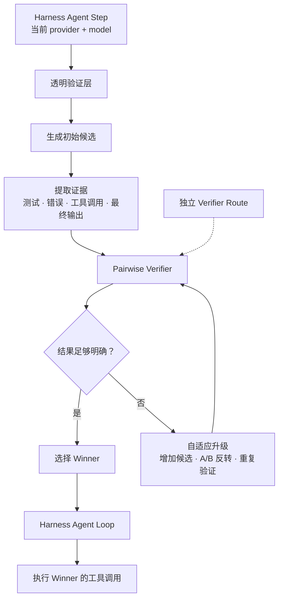

<div align="center">

# 🛡️ dsh-adaptive-verifier

**不要让 Agent 想到第一步就立刻执行。先生成几个候选，再验证，最后只执行更好的那个。**

一个面向 [DeepSeek Harness](https://github.com/deepseek-ai/deepseek-harness) 的 **自适应验证插件**。
它插在「模型生成」和「工具执行」之间，让 Agent 在真正改文件、跑命令、调用工具之前，先比较多个可能的下一步。

[English](README.md) · [快速开始](#-快速开始) · [工作原理](#-它是怎么工作的) · [配置](#-配置) · [文档](#-文档)

[](https://github.com/keepkeen/dsh-adaptive-verifier/actions/workflows/ci.yml)


</div>

> **一句话解释：** `dsh-adaptive-verifier` 会为一次 Agent step 生成多个候选回答，在任何候选工具调用真正执行之前先做验证和排序，最后只把获胜候选交回 Harness Agent Loop。

## ✨ 它到底是干嘛的？

普通 Coding Agent 的工作方式通常很直接：



问题是：**模型第一次想到的下一步，不一定是最好的下一步。**

它可能：

- 太早修改文件；
- 没检查上下文就执行命令；
- 忽略了测试失败或异常信息；
- 选择了一条能“说通”，但实际证据不够强的路线。

`dsh-adaptive-verifier` 做的事情，就是在中间增加一个选择层：



**落选候选中的工具调用不会执行。**

所以它的核心并不复杂：

> **把原来的「生成 → 执行」，改成「生成多个候选 → 比较 → 再执行」。**

## 🎯 核心能力

| | 做什么 |
|---|---|
| **多候选生成** | 复用当前 Harness Agent 已经选择的 provider/model，生成多个可能的下一步。 |
| **证据驱动验证** | 比较候选时优先看测试、错误、工具调用、最终输出等实际证据，而不是只相信模型自己说“完成了”。 |
| **自适应加计算** | 结果明显就立刻停止；结果模糊时才增加候选、交换 A/B 位置或重复验证。 |
| **只执行 Winner** | 只有获胜候选会回到 Harness Agent Loop，落选工具调用不会真正执行。 |
| **Provider Agnostic** | 默认通过 Harness 的 `ctx.llm` 工作，不绑定 DeepSeek 官方 API，也不接管 provider 的 Key。 |

它属于 **test-time verification / test-time scaling**：不是一个新模型，也不是 Harness 的替代品，而是给 Harness Agent 增加一层“执行前判断”。

## 🧠 它是怎么工作的？



这里最重要的是：**Generator 和 Verifier 是两条独立的 route。**

- **Generator route**：始终跟随当前 Harness Agent 选择的 provider/model。
- **Verifier route**：可以跟随当前 route，也可以固定成另一组 provider/model。
- **Credential**：默认 Harness 模式下仍由对应 provider adapter 管理，本插件不会复制、解析或猜测 API Key。

因此当前 Agent 可以使用：

- DeepSeek Official；
- OpenRouter；
- OpenAI-compatible gateway；
- Anthropic / OpenAI；
- 本地 vLLM；
- 其他 Harness adapter。

插件不会因为 model 名字里出现 `deepseek`，就把它错误地当成 DeepSeek 官方 HTTP API。

## 🚀 快速开始

### 1. 安装插件

```bash
git clone https://github.com/keepkeen/dsh-adaptive-verifier.git
cd dsh-adaptive-verifier

npm install --legacy-peer-deps

dsh plugin --profile verifier-lab add .
```

### 2. 确认 Harness 已加载

```bash
dsh --profile verifier-lab --dump-config
```

应该能看到 `adaptive-verifier` 这一行。

### 3. 正常启动 Harness

```bash
dsh --profile verifier-lab
```

默认情况下，到这里就可以用了。

**不需要再把模型切换成 `deepseek-verified`。** 继续使用你原来在 Harness 中选择的 provider/model 即可。

**默认 `backend: harness` 也不需要给插件额外配置 provider API Key。** Key 仍然由 Harness 对应的 adapter 管理。

## ⚙️ 配置

推荐先从最简单的配置开始：

```yaml
- id: adaptive-verifier
  config:
    adapter:
      enabled: true
      transparent: true
      targetProviders: []     # 空数组 = 对所有 Agent provider 生效
      initialCandidates: 2
      maxCandidates: 4

    verifier:
      backend: harness        # 默认，provider-agnostic
```

完整示例见 [`examples/profile.cordis.patch.yml`](examples/profile.cordis.patch.yml)。

### Generator 和 Verifier 使用同一路由

默认就是这样：

```yaml
verifier:
  backend: harness
```

`provider/model` 留空时，Verifier 会**通过 Harness**跟随当前 Agent route。

这不代表插件去读取当前 provider 的 Key——真正发送请求的仍然是 Harness adapter。

### 固定一个独立 Verifier

例如 Generator 跟着用户切换，而 Verifier 永远使用一个更便宜、更稳定的模型：

```yaml
verifier:
  backend: harness
  provider: deepseek-official
  model: deepseek-v4-flash
```

即使 Generator 是 OpenRouter、Anthropic 或本地模型，Verifier 也可以完全独立。

### 可选：DeepSeek logprob backend

Harness 通用 `StreamChunk` 当前没有统一暴露 token logprobs，所以连续 logprob 评分不可能对所有 provider 都通用。

如果你明确需要论文风格的 A–T 连续 expected score，可以显式启用：

```yaml
verifier:
  backend: deepseek-logprob
  model: deepseek-v4-flash
```

然后配置**独立的 Verifier credential**：

```bash
export DSH_VERIFIER_DEEPSEEK_API_KEY='...'
```

这个模式是显式 opt-in，绝不会从 Generator 的 provider/model 自动推断。

| Verifier backend | 支持范围 | Credential | 评分信号 |
|---|---|---|---|
| `harness` | 任意 Harness LLM route | Harness adapter 自己管理 | A–T 离散评分 + 自适应重复 |
| `deepseek-logprob` | 显式 DeepSeek HTTP backend | 独立 verifier 配置 | top-logprobs → 连续 A–T expected score |

**不确定用哪个，就使用 `backend: harness`。**

## 🔍 Verifier 到底看什么？

它不会只看模型最后一句“已经修复完成”。

验证时可以利用候选中的实际证据，例如：

- 是否满足任务要求和路径/格式约束；
- 测试、构建、lint 的实际输出；
- 是否还有 unresolved exception / failed command；
- 修改文件之后有没有重新验证；
- 工具调用是否过于激进、不可逆；
- 最终输出是否真的被终端或测试结果支持。

核心原则只有一句：

> **实际观察到的证据，比 Agent 自己声称“成功了”更重要。**

## 🧩 两种使用方式

### 1. 透明的 Action-level Verification

这是默认模式。

每次 Agent 要产生“下一步”时，插件先比较多个候选响应，再只放行一个 Winner。

最适合日常 Coding Agent 使用。

### 2. 完整轨迹排序

插件还暴露 `ctx.adaptiveVerifier`，用于你已经在别处生成完成的多个 trajectory：

```ts
const result = await ctx.adaptiveVerifier.select(task, [
  { id: 'run-a', content: trajectoryA },
  { id: 'run-b', content: trajectoryB },
  { id: 'run-c', content: trajectoryC },
])

console.log(result.selectedId)
console.log(result.ranking)
console.log(result.budget)
```

如果你要做完整 Best-of-N Coding Agent，**worktree/container/process 隔离仍然需要由调用方负责**。Harness Session fork 并不等于文件系统 fork。

## ⚖️ 代价和边界

Verification 不是免费的。

- 会比单路生成使用更多模型调用和 Token；
- 需要先缓冲多个候选，因此首 Token 延迟会更高；
- Verifier 和 Generator 仍可能共享 blind spot；
- 通用 Harness backend 没有 token-logprob 级别的不确定性信息。

因此本插件采用的是 **adaptive escalation**：

> 先用小预算判断；只有不确定时才继续花计算；达到预算后停止。

## 🧪 当前状态

`0.2.0` 已包含：

- Provider-agnostic Harness 集成；
- 透明多候选生成；
- 自适应 Pairwise Ranking；
- Evidence Extraction；
- Cache / Budget Control；
- CLI 与 Benchmark 工具；
- 可选 DeepSeek logprob backend。

目前仓库**不声称已经取得新的 Terminal-Bench / SWE-bench 成绩**。后续任何性能结论都应该基于固定 candidate pool，并完整报告 accuracy、token、API calls 和 latency。

## 📚 文档

- [API 与配置](docs/api.md)
- [架构设计](docs/architecture.md)
- [Benchmark 与消融](docs/benchmarking.md)
- [隔离语义](docs/isolation.md)
- [安全说明](SECURITY.md)
- [Changelog](CHANGELOG.md)

## License

MIT
